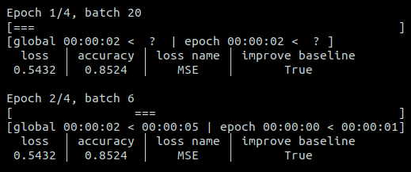

# Don't know the number of batches in advance?

If you don't have the number of batches in advance, you can initialize the logger with
`n_batches=None`. Only the available information will be displayed. For instance with
the configuration of the first example:

The progress bar is replaced by a cyclic animation. The eta times are not know at the
first epoch but was estimated after the second epoch.

Note that if you use `Logger.tqdm(dataset)` and the dataset has a length, the number of
batches will be automatically set to the length of the dataset.
