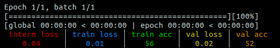

# Regex for log config (styles, sizes and average)

LoggerML use regex pattern matching to determine the config of the log for each parameter.

You can use regex for default configuration at initialization or in the `log` method.

To find the config of a parameter, LoogerML will look for the key in the following order:

1. Check if **log config** is a single value => use it
2. Check if **log config** is a dict
   1. Check if the key is in the dict => use it
   2. Check if the key is a regex pattern matching a key in the dict => use the last match
3. Check if **default config** is a single value => use it
4. Check if **default config** is a dict
   1. Check if the key is in the dict => use it
   2. Check if the key is a regex pattern matching a key in the dict => use the last match
5. Use hard-coded default value

For instance:

```python
logger = Logger(
    n_epochs=1,
    n_batches=1,
    # Default styles config
    styles={".* loss": "red", "train loss": "blue", ".* acc": "green"},
)
for _ in range(1):
    for _ in logger.tqdm(range(1)):
        logger.log(
            {
                "interm loss": 0.04,
                "train loss": 0.01,
                "train acc": 56,
                "val loss": 0.02,
                "val acc": 52
            },
            # Log styles config
            styles={"val.*": "yellow", "val acc": "orange3"}
        )
```

Yields:


