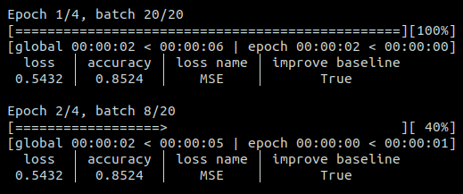
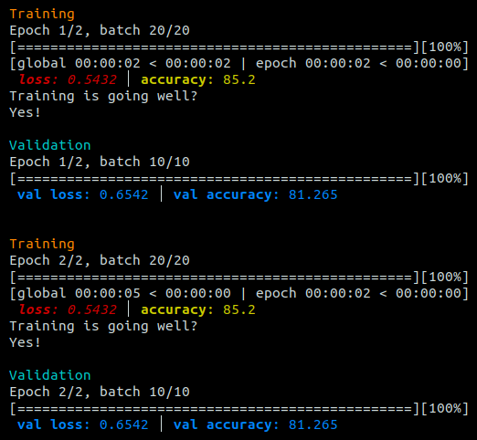

.. LoggerML documentation master file, created by
   sphinx-quickstart on Fri Apr 28 14:01:06 2023.
   You can adapt this file completely to your liking, but it should at least
   contain the root `toctree` directive.

LoggerML
========

**Rich machine learning logger in the console.**

Tired of watching a dull, unreadable or uninformative terminal screen
all day long to monitor your ML training? Use LoggerML to brighten up
your day in colour and save coding time!

Github project:
`valentingol/logml <https://github.com/valentingol/logml>`__.

|PyPI version| |PythonVersion| |License|

|Ruff_logo| |Black_logo|

|Ruff| |Flake8| |Pydocstyle| |MyPy| |PyLint|

|Tests| |Coverage| |Documentation|

Log your Machine Learning training in the console in a beautiful way
using `rich <https://github.com/Textualize/rich>`__\ ✨ with useful
information but with minimal code.

Simply add the a `logml.Logger` object in your training loop to have a complete
overview of your training in the console.

And then, you can simply customize your display to your liking, for instance
like this:

Have a look on the `Quick start` section!

.. |PyPI version| image:: https://badge.fury.io/py/loggerml.svg
   :target: https://badge.fury.io/py/loggerml
.. |PythonVersion| image:: https://img.shields.io/badge/python-3.7%20%7E%203.11-informational
.. |License| image:: https://img.shields.io/github/license/valentingol/logml?color=999
   :target: https://stringfixer.com/fr/MIT_license
.. |Ruff_logo| image:: https://img.shields.io/endpoint?url=https://raw.githubusercontent.com/charliermarsh/ruff/main/assets/badge/v1.json
   :target: https://github.com/charliermarsh/ruff
.. |Black_logo| image:: https://img.shields.io/badge/code%20style-black-000000.svg
   :target: https://github.com/psf/black
.. |Ruff| image:: https://github.com/valentingol/logml/actions/workflows/ruff.yaml/badge.svg
   :target: https://github.com/valentingol/logml/actions/workflows/ruff.yaml
.. |Flake8| image:: https://github.com/valentingol/logml/actions/workflows/flake.yaml/badge.svg
   :target: https://github.com/valentingol/logml/actions/workflows/flake.yaml
.. |Pydocstyle| image:: https://github.com/valentingol/logml/actions/workflows/pydocstyle.yaml/badge.svg
   :target: https://github.com/valentingol/logml/actions/workflows/pydocstyle.yaml
.. |MyPy| image:: https://github.com/valentingol/logml/actions/workflows/mypy.yaml/badge.svg
   :target: https://github.com/valentingol/logml/actions/workflows/mypy.yaml
.. |PyLint| image:: https://img.shields.io/endpoint?url=https://gist.githubusercontent.com/valentingol/451f91cece4478ebc81377e27e432f8b/raw/logml_pylint.json
   :target: https://github.com/valentingol/logml/actions/workflows/pylint.yaml
.. |Tests| image:: https://github.com/valentingol/logml/actions/workflows/tests.yaml/badge.svg
   :target: https://github.com/valentingol/logml/actions/workflows/tests.yaml
.. |Coverage| image:: https://img.shields.io/endpoint?url=https://gist.githubusercontent.com/valentingol/451f91cece4478ebc81377e27e432f8b/raw/logml_tests.json
   :target: https://github.com/valentingol/logml/actions/workflows/tests.yaml
.. |Documentation| image:: https://readthedocs.org/projects/logml/badge/?version=latest
   :target: https://logml.readthedocs.io/en/latest/?badge=latest

.. toctree::
   :maxdepth: 4
   :caption: Contents:

   installation
   quickstart
   vs_tqdm
   features/features
   logml_api
   contribute
   license
