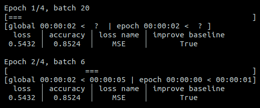

# Quick start

## Minimal usage

Integrate the LogML logger in your training loops! For instance for 4 epochs
and 20 batches per epoch:

```python
import time

from logml import Logger

logger = Logger(n_epochs=4, n_batches=20)

for _ in range(4):
    logger.new_epoch()  # Indicate the start of a new epoch
    for _ in range(20):
        logger.new_batch()  # Indicate the start of a new batch

        time.sleep(0.1)  # Simulate a training step

        # Log whatever you want (int, float, str, bool):
        logger.log({'loss': 0.54321256, 'accuracy': 0.85244777, 'loss name': 'MSE',
                    'improve baseline': True})
```

Yields:


## Advanced usage

Now you can customize the logger with your own styles and colors. You can set the
default configuration at the initialization of the logger and then you can override it
during log. You can also log the averaged value over the epoch. For instance:

```python
train_logger = Logger(
    n_epochs=2,
    n_batches=20,
    log_interval=2,
    name='Training',
    name_style='dark_orange',
    styles='yellow',
    sizes={'accuracy': 4},
    average=['loss'],  # loss will be averaged over the current epoch
    bold_keys=True,
    show_time=False,  # Remove the time bar
)
val_logger = Logger(
    n_epochs=2,
    n_batches=10,
    name='Validation',
    name_style='cyan',
    styles='blue',
    bold_keys=True,
    show_time=False,
)
for _ in range(2):
    train_logger.new_epoch()
    for _ in range(20):
        train_logger.new_batch()
        time.sleep(0.1)
        # Overwrite the default style for "loss" and add a message
        train_logger.log(
            {'loss': 0.54321256, 'accuracy': 85.244777},
            styles={'loss': 'italic red'},
            message="Training is going well?\nYes!",
        )
    val_logger.new_epoch()
    for _ in range(10):
        val_logger.new_batch()
        time.sleep(0.1)
        val_logger.log({'val loss': 0.65422135, 'val accuracy': 81.2658775})
```

Yields:


## Don't know the number of batches in advance?

If you don't have the number of batches in advance, you can initialize the logger with
`n_batches=None`. Only the available information will be displayed. For instance with
the configuration of the first example:



The progress bar is replaced by a cyclic animation. The eta times are not know at the
first epoch but was estimated after the second epoch.
